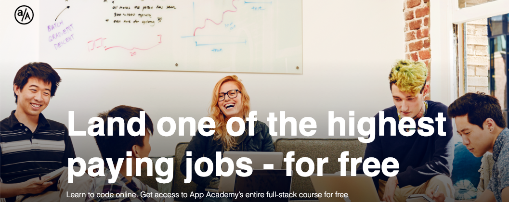

# app_academy_open
exercises and projects from app academy open

This repository will host source code files for my solutions to exercises or projects from the App Academy Open Full Stack Online curriculum. Most of the files will contain Ruby, SQL, and Ruby on Rails related code. 

The description taken from the https://open.appacademy.io website follows this line.

tl;dr: [click here to learn to code for free][open-url]

"App Academy Open allows free access to App Academy’s entire in-person full-stack curriculum, which has placed thousands of people in software development jobs. App Academy is ranked as the #1 coding bootcamp in the US and, since 2016, has placed more software developers at Google than UC Berkeley. The Software Engineering Curriculum has 1,500 hours of material (readings, videos, projects), an interactive coding environment, and community features like chat to keep you connected with thousands of prospective developers across the globe."

